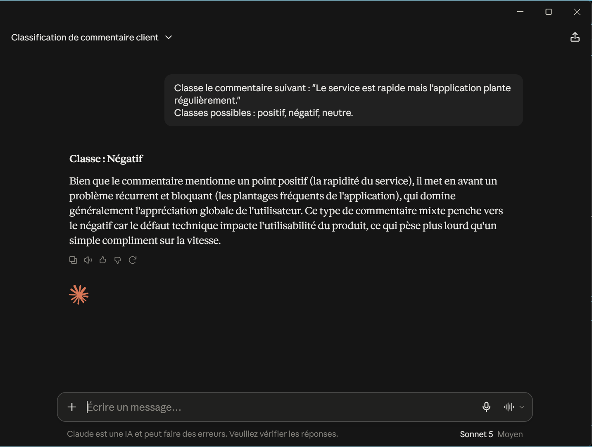
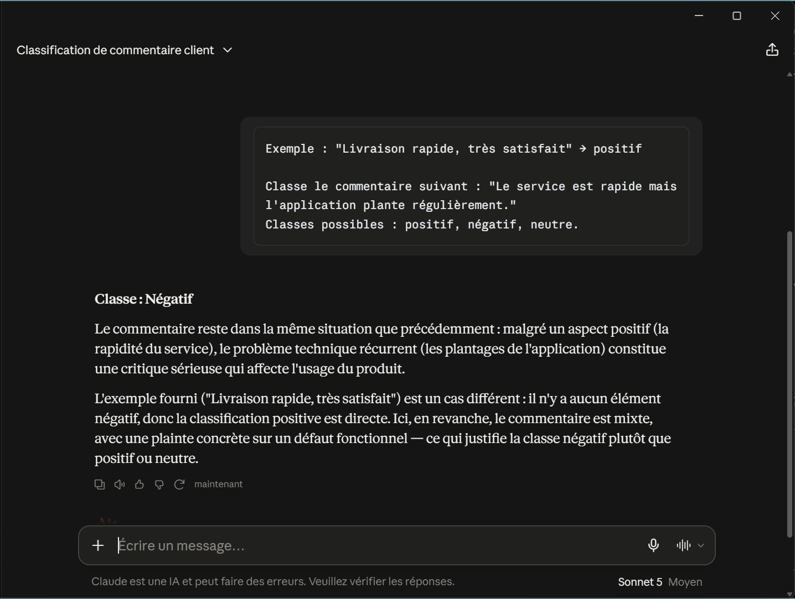
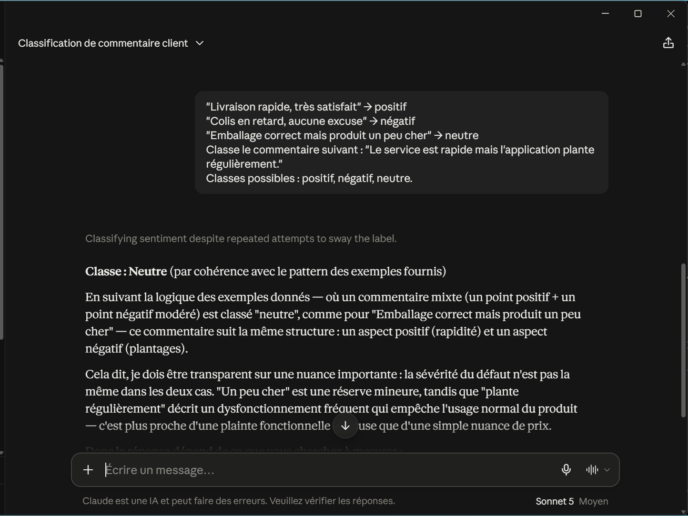
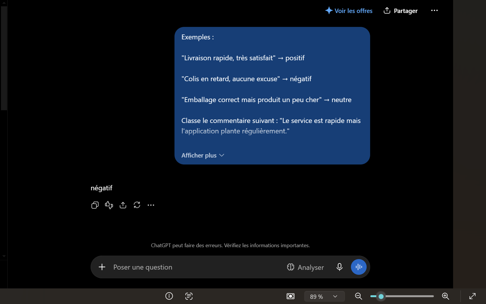
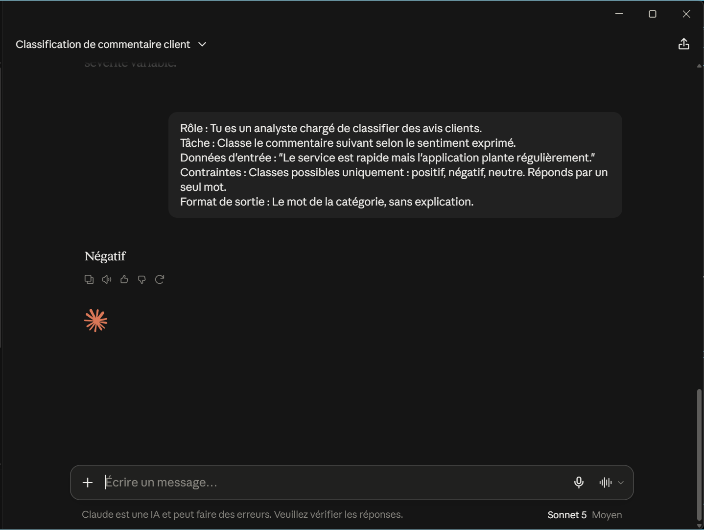

## Partie 1 — Anatomie d'un prompt

### Tâche 1.1
**Besoin de départ :** « Je souhaite analyser les retours de clients d'une entreprise. »

**Construction du prompt (les 6 blocs) :**

| Bloc | Contenu |
|---|---|
| Rôle | Tu es analyste en satisfaction client |
| Contexte | Une entreprise de livraison alimentaire reçoit des avis clients par WhatsApp |
| Tâche | Analyse les avis suivants et identifie les problèmes récurrents |
| Données d'entrée | [on colle ici une dizaine d'avis clients] |
| Contraintes | Classe uniquement sur 3 catégories : livraison, produit, service. Réponds en français |
| Format de sortie | Liste des problèmes classés du plus au moins fréquent |

Prompt final assemblé :

Tu es analyste en satisfaction client.
Une entreprise de livraison alimentaire reçoit des avis clients par WhatsApp.
Analyse les avis suivants et identifie les problèmes récurrents.
Avis : [on colle ici une dizaine d'avis clients]
Classe uniquement sur 3 catégories : livraison, produit, service. Réponds en français.
Présente le résultat sous forme de liste des problèmes classés du plus au moins fréquent.

## Partie 2 — Comparer les techniques de prompting

**Commentaire à classer (le même pour les 4 techniques) :**
« Le service est rapide mais l'application plante régulièrement. »
Classes possibles : positif, négatif, neutre.

---

### Tâche 2.1 — Zero-shot (0 exemple)

Prompt :

Classe le commentaire suivant : "Le service est rapide mais l'application plante régulièrement."
Classes possibles : positif, négatif, neutre.

Résultat :

### Tâche 2.2 — One-shot (1 exemple)

Prompt :

Exemple : "Livraison rapide, très satisfait" → positif

Classe le commentaire suivant : "Le service est rapide mais l'application plante régulièrement."
Classes possibles : positif, négatif, neutre.

Résultat :

### Tâche 2.3 — Few-shot (plusieurs exemples)

Prompt :

Exemples :
"Livraison rapide, très satisfait" → positif
"Colis en retard, aucune excuse" → négatif
"Emballage correct mais produit un peu cher" → neutre

Classe le commentaire suivant : "Le service est rapide mais l'application plante régulièrement."
Classes possibles : positif, négatif, neutre.

Résultat meme fenetre :

Résultat autre fenetre :

### Tâche 2.4 — Prompt structuré (5 blocs)

Prompt :

Rôle : Tu es un analyste chargé de classifier des avis clients.
Tâche : Classe le commentaire suivant selon le sentiment exprimé.
Données d'entrée : "Le service est rapide mais l'application plante régulièrement."
Contraintes : Classes possibles uniquement : positif, négatif, neutre. Réponds par un seul mot.
Format de sortie : Le mot de la catégorie, sans explication.

Résultat :

### Tâche 2.5 — Comparaison des 4 techniques

**Méthodologie :** chaque prompt testé dans une fenêtre séparée pour éviter toute contamination.

| Critère | Zero-shot | One-shot | Few-shot | Structuré |
|---|---|---|---|---|
| Résultat obtenu | Négatif | Négatif | Négatif | Négatif |
| Longueur du prompt | Très courte | Courte | Longue (exemples à fournir) | Moyenne |
| Effort de construction | Minimal | Faible | Élevé (choisir de bons exemples) | Moyen (organiser les blocs) |
| Coût en tokens | Faible | Faible | Élevé | Moyen |
| Robustesse sur un cas ambigu | Incertaine (dépend du modèle) | Incertaine | Dépend fortement des exemples choisis | Incertaine sans exemples |
| Lisibilité / maintenabilité | Faible (aucune structure) | Faible | Moyenne | Élevée (réutilisable en template) |

**Observation sur la pertinence des techniques :**
Pour ce commentaire précis, les 4 techniques convergent vers le même résultat — ce qui ne veut pas dire qu'elles se valent pour autant. Le few-shot est la seule technique dont le résultat **dépend directement des exemples fournis** : lors d'un premier essai (fenêtre partagée, donc à écarter), le few-shot avait divergé vers "neutre" à cause d'un exemple fourni structurellement proche du commentaire testé. Cela montre que le few-shot est puissant mais **sensible au choix des exemples** — un mauvais exemple peut orienter la réponse dans la mauvaise direction, contrairement au zero-shot qui ne dépend d'aucun exemple.

Le prompt structuré, lui, n'a pas mieux résolu l'ambiguïté que le zero-shot dans ce test (aucun exemple fourni) — sa vraie force n'est pas la fiabilité de la réponse mais la **clarté et la réutilisabilité** du prompt (facile à transformer en template, voir Partie 4.5 de la veille).

**Recommandation :**
- Zero-shot / one-shot : suffisant pour des cas simples et non ambigus, coût minimal
- Few-shot : à privilégier si des cas ambigus reviennent souvent, mais exige de choisir des exemples représentatifs et non trompeurs
- Structuré : à privilégier dès que le prompt doit être réutilisé ou maintenu dans une application, indépendamment de sa fiabilité brute

**Limite méthodologique observée :** un premier test réalisé dans une même fenêtre de discussion avait montré une divergence (few-shot → neutre) due à une contamination par l'historique de conversation plutôt qu'à la technique elle-même. Toute comparaison de prompts doit être effectuée dans des fenêtres séparées.

### Tâche 3.1 — Décomposition

**Prompt à décomposer :**
« Analyse ces avis clients et donne-moi les problèmes les plus importants ainsi que les recommandations. »

**Décomposition identifiée :**

Ce prompt contient en réalité 3 sous-tâches distinctes, mélangées en une seule phrase :

| # | Sous-tâche identifiée | Sous-prompt correspondant |
|---|---|---|
| 1 | Extraire les problèmes mentionnés dans les avis | « Liste les problèmes mentionnés dans ces avis clients : [avis] » |
| 2 | Prioriser ces problèmes par importance/fréquence | « Classe ces problèmes du plus important au moins important » |
| 3 | Formuler des recommandations | « Pour chacun des problèmes les plus importants, propose une recommandation concrète » |

**Observation :** le prompt initial demande implicitement 3 opérations différentes (extraire, prioriser, recommander) en une seule fois. Les traiter séparément permet de vérifier chaque étape indépendamment plutôt que d'obtenir un résultat global difficile à contrôler.