## Partie 1 — Anatomie d'un prompt

### Tâche 1.1
**Besoin de départ :** « Je souhaite analyser les retours de clients d'une entreprise. »

**Construction du prompt (les 6 blocs) :**

| Bloc | Contenu |
|---|---|
| Rôle | Tu es analyste en satisfaction client |
| Contexte | Une entreprise de livraison alimentaire reçoit des avis clients par WhatsApp |
| Tâche | Analyse les avis suivants et identifie les problèmes récurrents |
| Données d'entrée | [on colle ici une dizaine d'avis clients] |
| Contraintes | Classe uniquement sur 3 catégories : livraison, produit, service. Réponds en français |
| Format de sortie | Liste des problèmes classés du plus au moins fréquent |

Prompt final assemblé :

Tu es analyste en satisfaction client.
Une entreprise de livraison alimentaire reçoit des avis clients par WhatsApp.
Analyse les avis suivants et identifie les problèmes récurrents.
Avis : [on colle ici une dizaine d'avis clients]
Classe uniquement sur 3 catégories : livraison, produit, service. Réponds en français.
Présente le résultat sous forme de liste des problèmes classés du plus au moins fréquent.

## Partie 2 — Comparer les techniques de prompting

**Commentaire à classer (le même pour les 4 techniques) :**
« Le service est rapide mais l'application plante régulièrement. »
Classes possibles : positif, négatif, neutre.

---

### Tâche 2.1 — Zero-shot (0 exemple)

Prompt :

Classe le commentaire suivant : "Le service est rapide mais l'application plante régulièrement."
Classes possibles : positif, négatif, neutre.

Résultat :


### Tâche 2.2 — One-shot (1 exemple)

Prompt :

Exemple : "Livraison rapide, très satisfait" → positif

Classe le commentaire suivant : "Le service est rapide mais l'application plante régulièrement."
Classes possibles : positif, négatif, neutre.

Résultat :


### Tâche 2.3 — Few-shot (plusieurs exemples)

Prompt :

Exemples :
"Livraison rapide, très satisfait" → positif
"Colis en retard, aucune excuse" → négatif
"Emballage correct mais produit un peu cher" → neutre

Classe le commentaire suivant : "Le service est rapide mais l'application plante régulièrement."
Classes possibles : positif, négatif, neutre.

Résultat meme fenetre :


Résultat autre fenetre :


### Tâche 2.4 — Prompt structuré (5 blocs)

Prompt :

Rôle : Tu es un analyste chargé de classifier des avis clients.
Tâche : Classe le commentaire suivant selon le sentiment exprimé.
Données d'entrée : "Le service est rapide mais l'application plante régulièrement."
Contraintes : Classes possibles uniquement : positif, négatif, neutre. Réponds par un seul mot.
Format de sortie : Le mot de la catégorie, sans explication.

Résultat :


### Tâche 2.5 — Comparaison des 4 techniques

**Méthodologie :** chaque prompt testé dans une fenêtre séparée pour éviter toute contamination.

| Critère | Zero-shot | One-shot | Few-shot | Structuré |
|---|---|---|---|---|
| Résultat obtenu | Négatif | Négatif | Négatif | Négatif |
| Longueur du prompt | Très courte | Courte | Longue (exemples à fournir) | Moyenne |
| Effort de construction | Minimal | Faible | Élevé (choisir de bons exemples) | Moyen (organiser les blocs) |
| Coût en tokens | Faible | Faible | Élevé | Moyen |
| Robustesse sur un cas ambigu | Incertaine (dépend du modèle) | Incertaine | Dépend fortement des exemples choisis | Incertaine sans exemples |
| Lisibilité / maintenabilité | Faible (aucune structure) | Faible | Moyenne | Élevée (réutilisable en template) |

**Observation sur la pertinence des techniques :**
Pour ce commentaire précis, les 4 techniques convergent vers le même résultat — ce qui ne veut pas dire qu'elles se valent pour autant. Le few-shot est la seule technique dont le résultat **dépend directement des exemples fournis** : lors d'un premier essai (fenêtre partagée, donc à écarter), le few-shot avait divergé vers "neutre" à cause d'un exemple fourni structurellement proche du commentaire testé. Cela montre que le few-shot est puissant mais **sensible au choix des exemples** — un mauvais exemple peut orienter la réponse dans la mauvaise direction, contrairement au zero-shot qui ne dépend d'aucun exemple.

Le prompt structuré, lui, n'a pas mieux résolu l'ambiguïté que le zero-shot dans ce test (aucun exemple fourni) — sa vraie force n'est pas la fiabilité de la réponse mais la **clarté et la réutilisabilité** du prompt (facile à transformer en template, voir Partie 4.5 de la veille).

**Recommandation :**
- Zero-shot / one-shot : suffisant pour des cas simples et non ambigus, coût minimal
- Few-shot : à privilégier si des cas ambigus reviennent souvent, mais exige de choisir des exemples représentatifs et non trompeurs
- Structuré : à privilégier dès que le prompt doit être réutilisé ou maintenu dans une application, indépendamment de sa fiabilité brute

**Limite méthodologique observée :** un premier test réalisé dans une même fenêtre de discussion avait montré une divergence (few-shot → neutre) due à une contamination par l'historique de conversation plutôt qu'à la technique elle-même. Toute comparaison de prompts doit être effectuée dans des fenêtres séparées.


### Tâche 3.1 — Décomposition

**Prompt à décomposer :**
« Analyse ces avis clients et donne-moi les problèmes les plus importants ainsi que les recommandations. »

**Décomposition identifiée :**

Ce prompt contient en réalité 3 sous-tâches distinctes, mélangées en une seule phrase :

| # | Sous-tâche identifiée | Sous-prompt correspondant |
|---|---|---|
| 1 | Extraire les problèmes mentionnés dans les avis | « Liste les problèmes mentionnés dans ces avis clients : [avis] » |
| 2 | Prioriser ces problèmes par importance/fréquence | « Classe ces problèmes du plus important au moins important » |
| 3 | Formuler des recommandations | « Pour chacun des problèmes les plus importants, propose une recommandation concrète » |

**Observation :** le prompt initial demande implicitement 3 opérations différentes (extraire, prioriser, recommander) en une seule fois. Les traiter séparément permet de vérifier chaque étape indépendamment plutôt que d'obtenir un résultat global difficile à contrôler.*

### Tâche 3.2 — Texte avec contraintes + vérification

**Premier prompt (texte + contraintes) :**

Analyse le texte suivant et identifie les informations clés (chiffres, difficultés rencontrées, recommandations).


Texte : [Rapport d'activité — BARAKA DISTRIBUTION — Août 2026  Au cours du mois d'août, BARAKA DISTRIBUTION a effectué 1 250 livraisons, contre 1 060 en juillet, soit une hausse de 18 %. Le chiffre d'affaires du mois s'élève à 9 375 000 FCFA. Le taux de satisfaction client mesuré par sondage post-livraison atteint 94 %, en progression de 3 points par rapport au mois précédent.  Les principales difficultés observées concernent les livraisons du vendredi soir, où le délai moyen dépasse de 12 minutes le délai habituel, en raison d'une forte demande concentrée entre 19h et 21h dans les quartiers périphériques de Dakar. Trois livreurs supplémentaires ont été recrutés en cours de mois pour absorber cette charge, mais leur formation ne sera achevée qu'en septembre.  Sur le plan des produits, le poisson thiof et les œufs restent les articles les plus commandés, représentant à eux deux 42 % du volume total des commandes. Un incident isolé a été signalé concernant un lot d'huile végétale livré avec un emballage endommagé ; les clients concernés ont été remboursés intégralement.  La direction recommande de renforcer les équipes de livraison le week-end avant la fin du mois de septembre, et d'ouvrir une deuxième zone de stockage pour réduire les distances parcourues vers les quartiers périphériques.  ]


Contraintes :


Reste strictement factuel

N'invente aucune information absente du texte

Ne cite que des éléments réellement présents dans le texte

**Résultat du 1er prompt :**
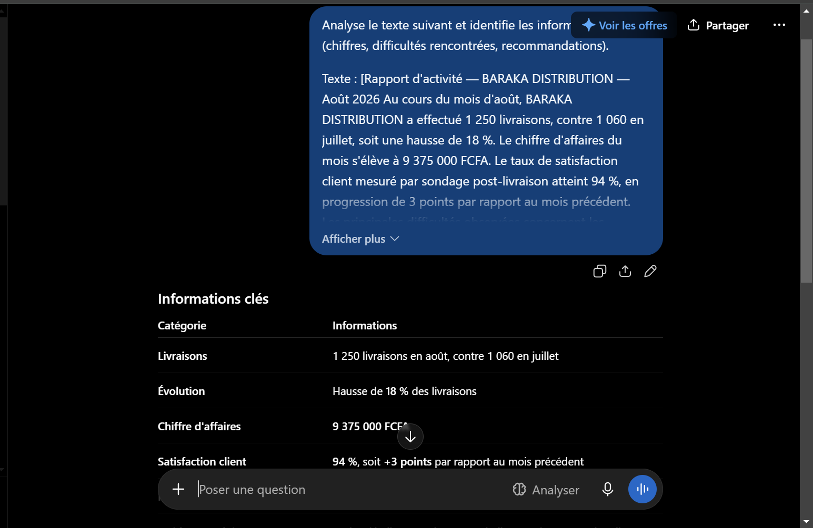

**Second prompt (vérification de la réponse précédente) :**

Relis ta réponse précédente et vérifie-la point par point :

Y a-t-il des informations non justifiées par le texte source ?
Y a-t-il des contradictions ?
Des informations présentes dans le texte sont-elles absentes de ta réponse ?
Y a-t-il d'éventuelles hallucinations (faits inventés) ?
Les contraintes données initialement ont-elles été respectées ?
Corrige ta réponse si nécessaire.

**Résultat du second prompt :**
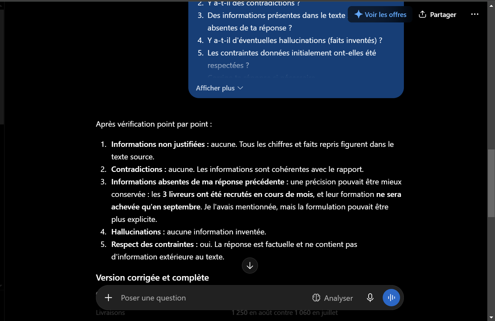


## Partie 4 — Sorties structurées

### Tâche 4.1 — Prompt JSON avec champs typés

**Commentaire client à analyser :**
« Ma commande a été livrée avec plus d'une heure de retard, je suis très mécontent. »

**Prompt :**
Analyse le commentaire client suivant et retourne uniquement un JSON avec les champs :

sentiment (chaîne de caractères) : positif, negatif ou neutre
categorie (chaîne de caractères) : le thème du commentaire, par exemple livraison, produit ou service
urgence (chaîne de caractères) : faible, moyenne ou élevée
probleme (chaîne de caractères) : description courte du problème identifié
confiance (nombre décimal) : score de confiance entre 0 et 1

Commentaire : "Ma commande a été livrée avec plus d'une heure de retard, je suis très mécontent."

Réponds uniquement avec le JSON, sans aucun texte avant ou après.


**Résultat attendu (exemple donné dans l'énoncé) :**
```json
{
  "sentiment": "negatif",
  "categorie": "livraison",
  "urgence": "moyenne",
  "probleme": "Retard de livraison",
  "confiance": 0.91
}
```

**Résultat obtenu :**
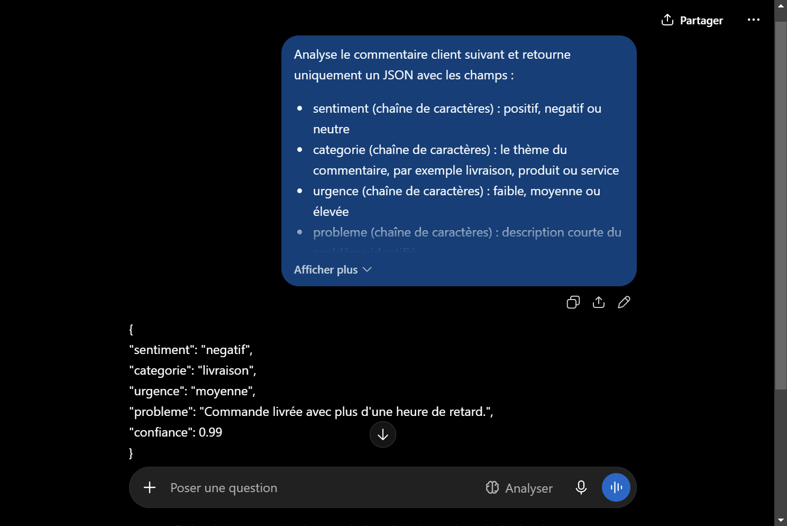

### Tâche 4.2 — Ajout des règles de validation

**Prompt (version enrichie du prompt 4.1.avec la validation incluse ) :**

Analyse le commentaire client suivant et retourne uniquement un JSON avec les champs :

sentiment (chaîne de caractères)
categorie (chaîne de caractères)
urgence (chaîne de caractères)
probleme (chaîne de caractères)
confiance (nombre décimal)

Commentaire : "Ma commande a été livrée avec plus d'une heure de retard, je suis très mécontent."

Règles de sortie à respecter strictement :

Le format doit être un JSON valide
Aucune propriété supplémentaire ne doit être ajoutée
sentiment doit valoir uniquement : positif, negatif ou neutre
confiance doit être un nombre compris entre 0 et 1
urgence doit valoir uniquement : faible, moyenne ou élevée

Réponds uniquement avec le JSON, sans aucun texte avant ou après.

**Résultat obtenu :**
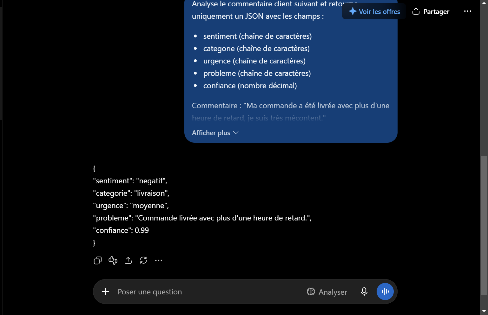

## Partie 5 — Prompts pour les applications métier

### Tâche 5.1 — Résumé de document


**Prompt :**

Résume le document suivant.
Contraintes :

Maximum 250 mots
Conserver les informations factuelles
Identifier les objectifs
Identifier les résultats
Identifier les recommandations
N'invente aucune information absente du document

Document : [**Document à résumer :**
« Rapport de projet — Migration du système de gestion des stocks — BARAKA DISTRIBUTION. Ce projet visait à réduire les ruptures de stock récurrentes sur les produits les plus vendus et à améliorer la traçabilité des livraisons entre l'entrepôt central et les points de vente. Un nouveau logiciel de suivi des stocks a été déployé en juillet 2026 sur l'ensemble des trois entrepôts. Après six semaines d'utilisation, les ruptures de stock ont diminué de 35 %, et le temps moyen de traitement d'une commande est passé de 45 à 28 minutes. Deux employés ont néanmoins signalé des difficultés à utiliser l'interface mobile de l'application. Il est recommandé d'organiser une session de formation complémentaire pour les équipes terrain et d'étendre le déploiement à l'entrepôt secondaire de Thiès avant la fin de l'année. »]
Le projet de migration du système de gestion des stocks de BARAKA DISTRIBUTION avait pour objectifs de réduire les ruptures de stock récurrentes sur les produits les plus vendus et d’améliorer la traçabilité des livraisons entre l’entrepôt central et les points de vente.

**Résultat :**
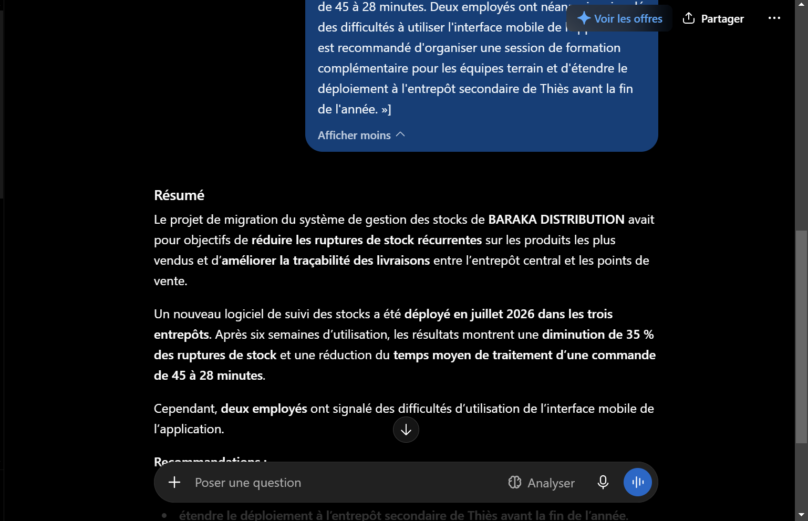

### Tâche 5.2 — Traduction FR → EN


**Prompt :**
Traduis le document suivant du français vers l'anglais.
Contraintes :

Conserver le sens
Conserver la structure
Conserver les termes techniques
Ne pas résumer
Ne rajoute aucune information

Document : [**Document à traduire :**
« La chaîne du froid est garantie de bout en bout grâce à des glacières certifiées ISO 22000. Chaque livraison est accompagnée d'un relevé de température consigné au moment du dépôt chez le client. »]


**Résultat :**
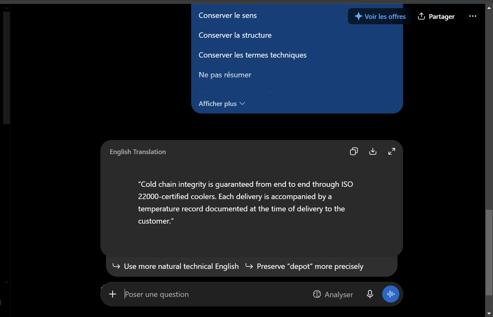
### Tâche 5.3 — Classification d'un ticket informatique


**Prompt :**
Classe le ticket informatique suivant dans l'une des catégories suivantes uniquement : réseau, logiciel, matériel, sécurité, accès, autre.

Ticket : [**Ticket à classer :**
« Je n'arrive plus à me connecter à mon compte depuis ce matin, le mot de passe est refusé alors qu'il est correct. »]

Réponds uniquement en JSON avec les champs categorie et justification.


**Résultat :**
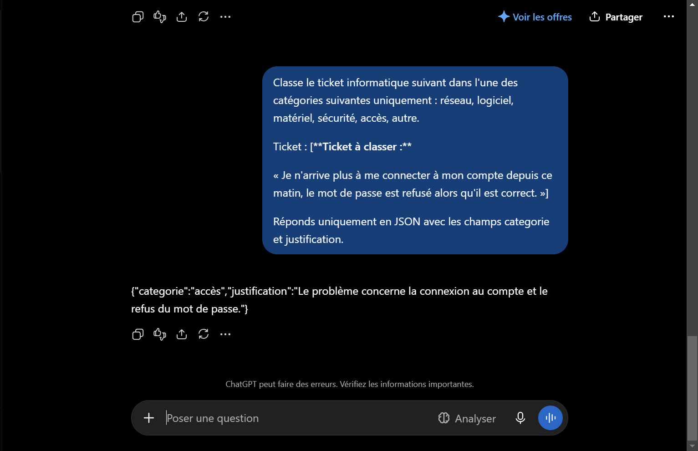

### Tâche 5.4 — Extraction d'informations depuis une facture


**Prompt :**

Extrais les informations suivantes de la facture ci-dessous : numéro_facture, date, client, montant_ht, tva, montant_ttc.

Facture : [**Facture fournie :**

FACTURE N° FA-2026-0847
Date : 5 septembre 2026
Client : Restaurant Teranga
Montant HT : 125 000 FCFA
Montant TTC : 125 000 FCFA
]

Retourne uniquement un JSON valide avec ces 6 champs. Si une information est absente, indique null.


**Résultat :**
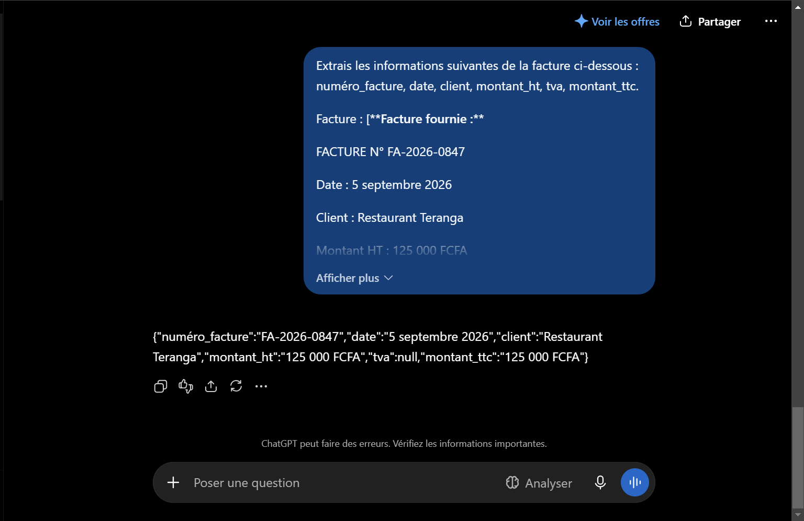

### Tâche 5.5 — Email pour un retard de livraison

**Prompt :**

Rédige un email destiné à un client dont la livraison a pris du retard.
Objectifs :

Reconnaître le retard
Présenter des excuses
Expliquer la situation sans inventer de cause précise
Proposer une solution
Ton : professionnel, courtois et rassurant
Longueur maximale : 150 mots

**Résultat :**
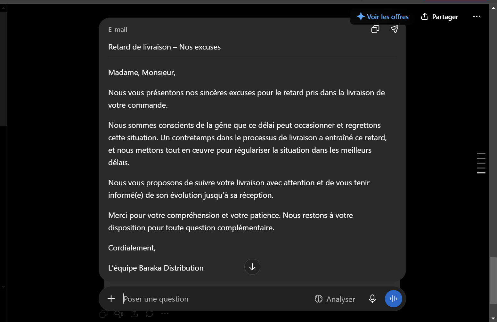

## Partie 6 — Prompt Engineering pour le Machine Learning

### Tâche 6.1 — Stratégies de traitement des données

**Prompt :**

Voici un dataset de capteurs IoT installés dans un bâtiment (605 lignes au total) :

Colonnes : temperature (float), humidity (float), pressure (float), consumption (float), status (catégorielle : normal/alerte/critique)

Échantillon de 15 lignes :
temperature | humidity | pressure | consumption | status
22.4 | 45.2 | 1013.1 | 340.5 | normal
23.1 | 46.8 | 1012.7 | 355.2 | normal
21.9 | 44.5 | 1013.4 | 332.0 | normal
24.0 | 47.9 | 1012.2 | 360.8 | normal
NaN | 47.1 | 1013.5 | 348.0 | normal
22.3 | 47.0 | 1013.2 | 347.8 | normal
22.3 | 47.0 | 1013.2 | 347.8 | normal
28.6 | 52.3 | 1010.8 | 512.4 | alerte
29.1 | 53.0 | 1010.5 | 528.7 | alerte
41.7 | 44.9 | 1011.9 | 890.3 | critique
30.2 | 54.1 | 1009.9 | 540.2 | alerte
22.0 | 45.0 | 1013.0 | 338.0 | normal
-5.0 | 46.0 | 1013.1 | 340.0 | normal
22.6 | 45.6 | 1013.0 | 342.1 | normal
33.5 | 58.2 | 1008.7 | 610.0 | critique

Propose des stratégies de traitement pour chacun des éléments suivants :

Valeurs manquantes
Doublons
Valeurs aberrantes
Variables catégorielles

Pour chacun, indique : la méthode de détection, la stratégie de traitement, les risques associés.

Format : tableau avec colonnes Problème / Détection / Traitement / Risques associés.

**Résultat :**
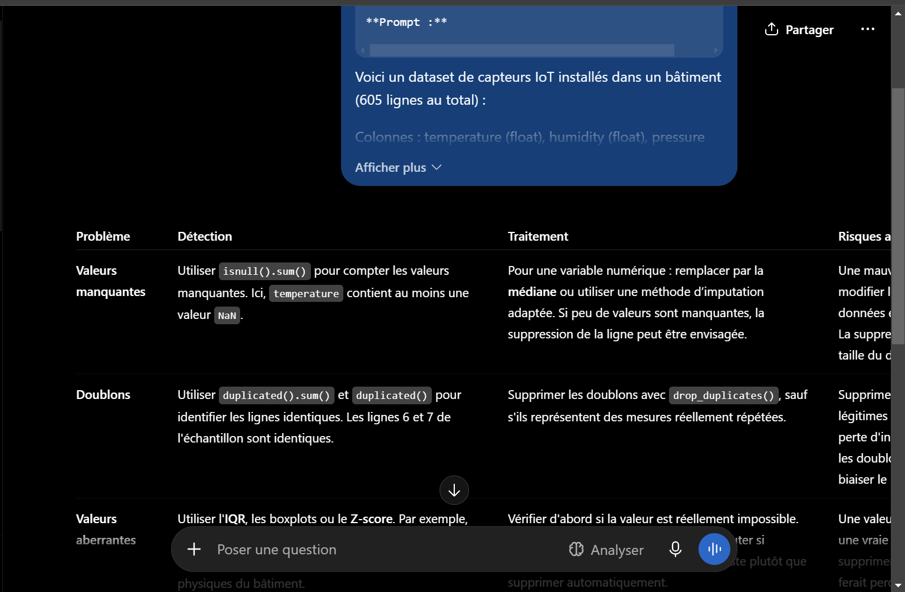

### Tâche 6.2 — Visualisations pertinentes

**Prompt :**

Propose les visualisations les plus pertinentes pour comprendre la consommation énergétique du bâtiment.

Pour chaque visualisation, indique :

Le type de graphique
Les variables utilisées
L'objectif
L'interprétation attendue

Format : une section par visualisation.


**Résultat :**
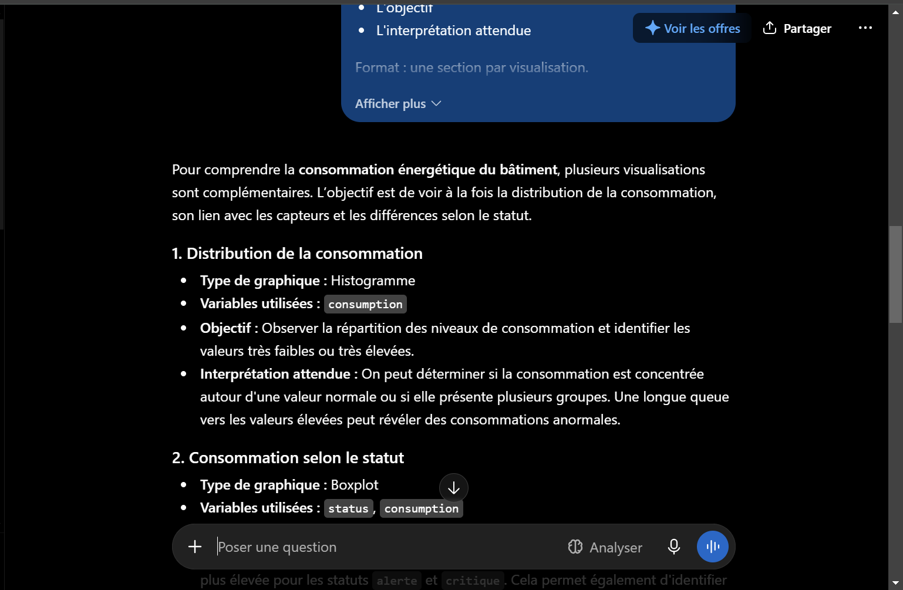


### Tâche 6.3 — Modèles de prédiction

**Prompt :**

Propose plusieurs modèles adaptés à la prédiction de la consommation énergétique du bâtiment.

Pour chaque modèle, indique :

Le principe
Les avantages
Les limites
Le type de problème
Les métriques pertinentes

Format : tableau avec colonnes Modèle / Principe / Avantages / Limites / Type de problème / Métriques.

**Résultat :**
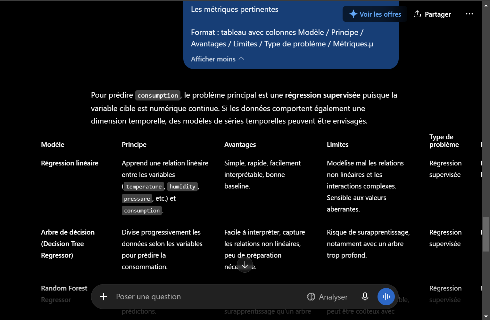

### Tâche 6.4 — Métriques de classification

**Prompt :**

Explique les métriques de classification suivantes : Accuracy, Precision, Recall, F1-score, ROC-AUC.

Pour chacune, donne :

La définition
L'interprétation
Un exemple concret
Le contexte dans lequel elle est particulièrement utile

Format : une section par métrique.


**Résultat :**
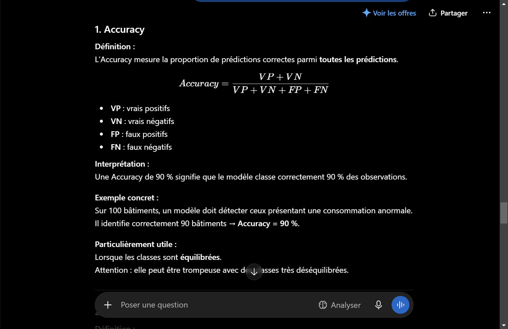

### Tâche 6.5 — Métriques de régression

**Prompt :**

Explique les métriques de régression suivantes : MAE, MSE, RMSE.

Pour chacune, donne :

La définition
L'interprétation
Un exemple concret
Le contexte dans lequel elle est particulièrement utile

Format : une section par métrique.


**Résultat :**
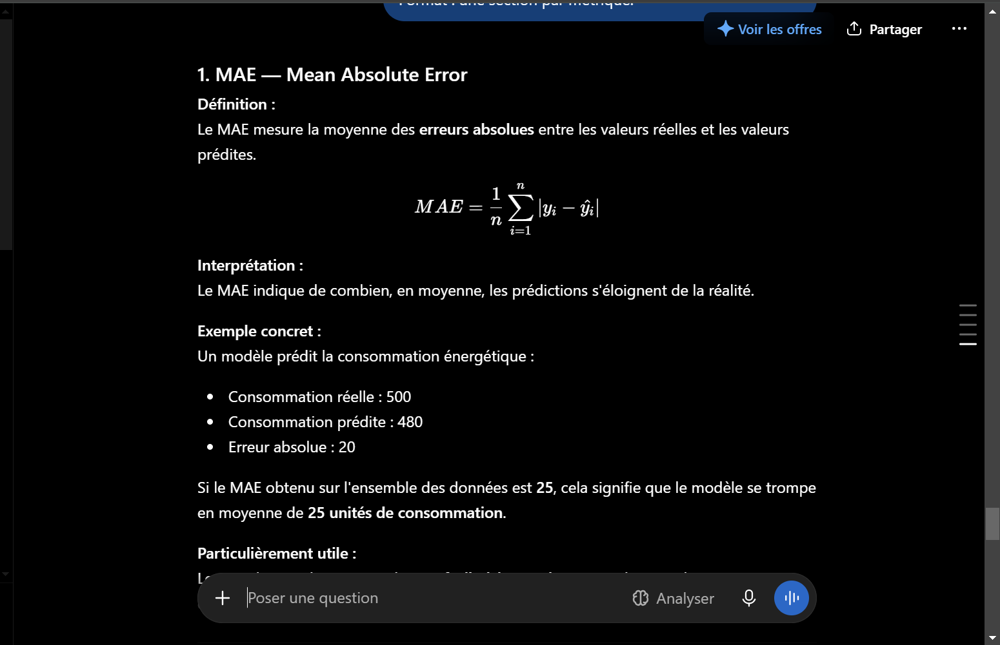

## Partie 7 — Prompt Engineering et RAG

### Tâche 7.1 — Document de référence

**Document utilisé :** *La psychologie humaine — Fondements théoriques et pathologies associées* (PDF, 10 pages)

---
### Tâche 7.2 — Trois prompts, une seule question

#### Prompt A — sans fournir le document

**Prompt :**

Quels sont les facteurs de protection contre les troubles mentaux mentionnés dans le document, et quel modèle explicatif combine facteurs de vulnérabilité et facteurs de stress ?


**Résultat :**
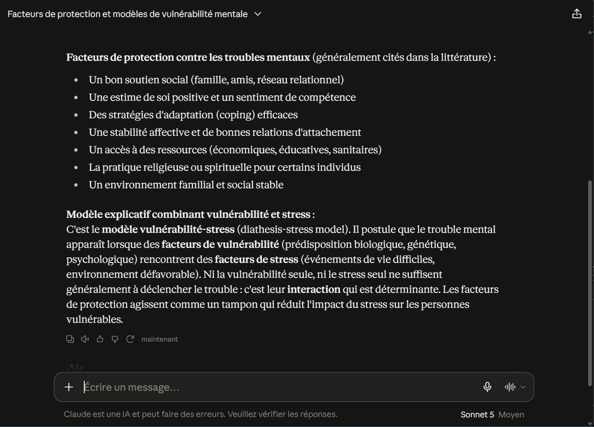


#### Prompt B — en fournissant le document

**Prompt :**

[Joindre ou coller le PDF "La psychologie humaine"]

Quels sont les facteurs de protection contre les troubles mentaux mentionnés dans le document, et quel modèle explicatif combine facteurs de vulnérabilité et facteurs de stress ?


**Résultat :**
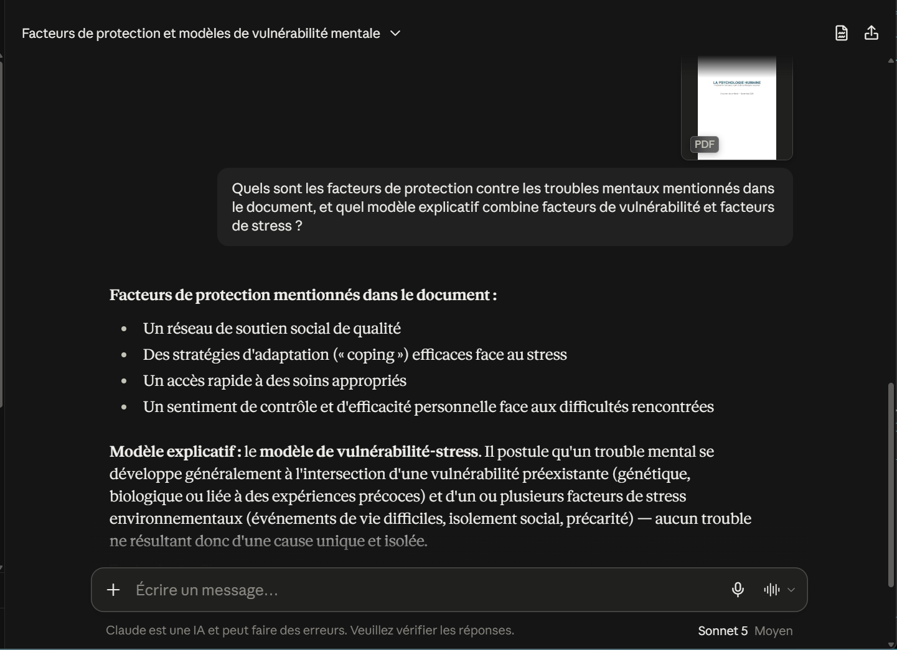

#### Prompt C — document + contraintes anti-hallucination

**Prompt :**

[Joindre ou coller le PDF "La psychologie humaine"]

Quels sont les facteurs de protection contre les troubles mentaux mentionnés dans le document, et quel modèle explicatif combine facteurs de vulnérabilité et facteurs de stress ?

Contraintes :

Utilise uniquement le contexte fourni dans le document
N'invente aucune information absente du document
Si une information n'est pas trouvée dans le document, signale-le clairement
Cite la section ou le passage utilisé
**Résultat :**
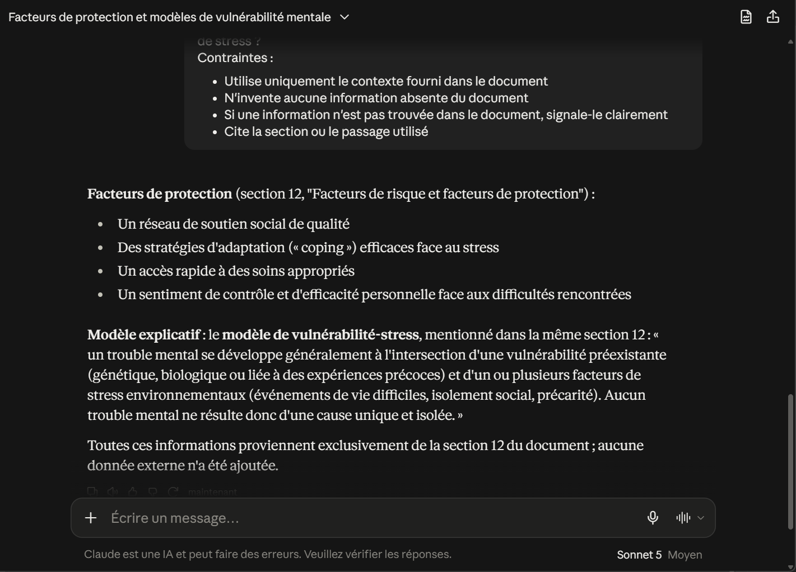
